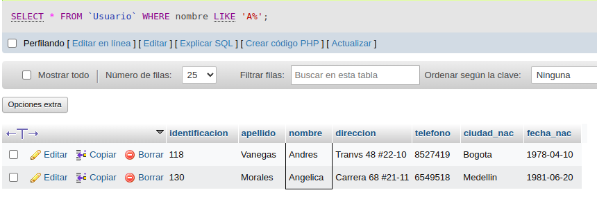
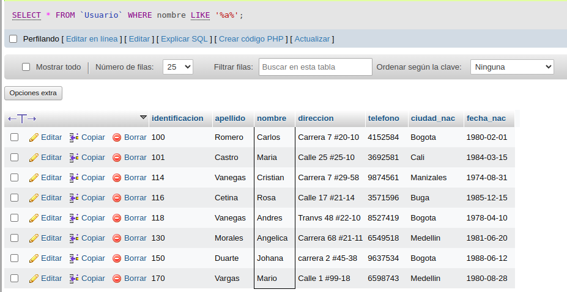
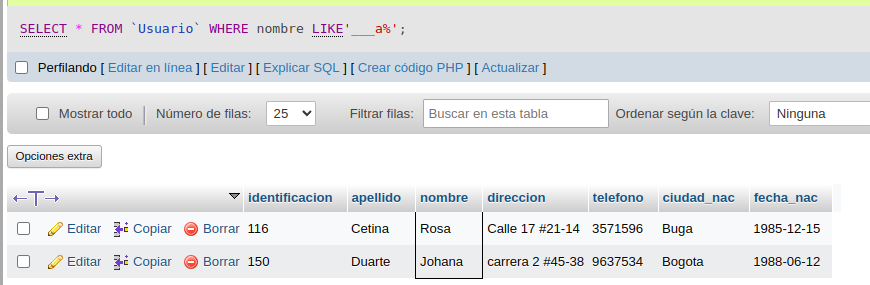
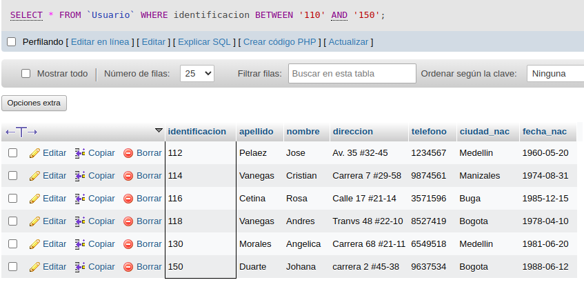
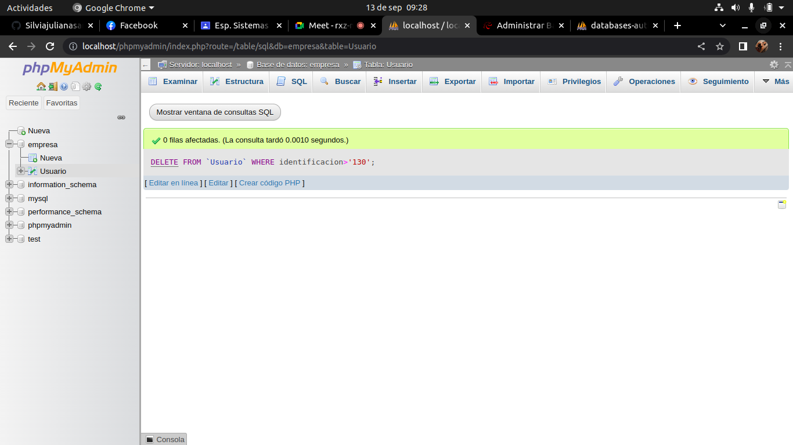
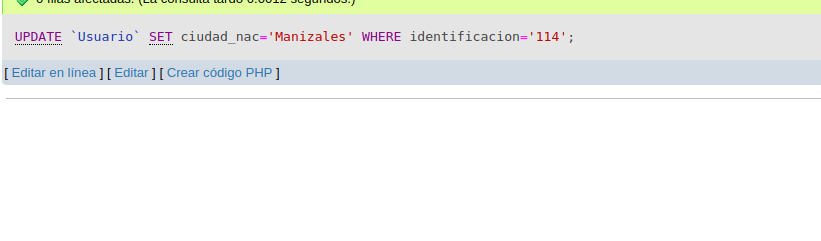
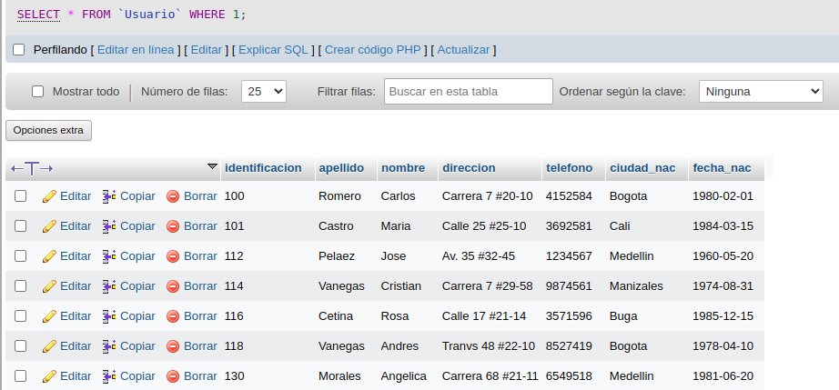
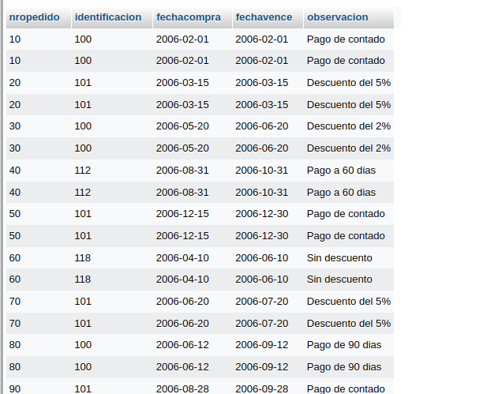
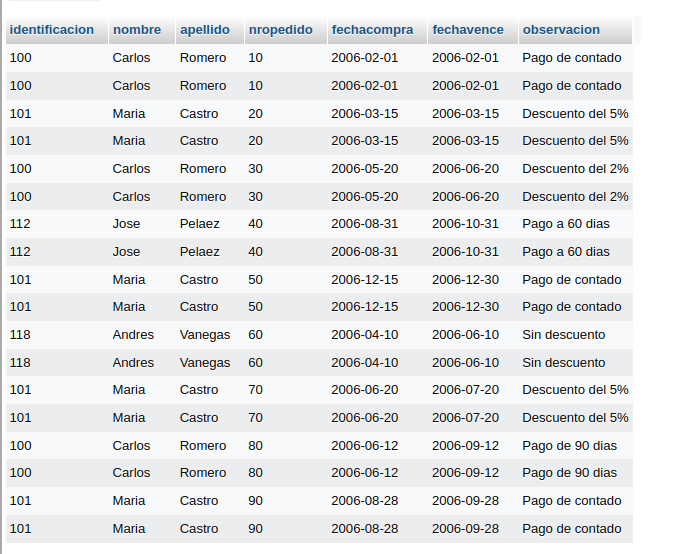

# consultas1.SQL

# EJERCICIOS CONSULTAS SQL

## Tabla de usuario

## COMANDO SELECT

1. Para visualizar toda la informacion que contiene la tabla `usuario` se puede incluir con la instruccion SELECT el caracter'*' o cada uno de los campos 

SELECT * FROM `Usuario` 

2. Visualizar solamente la identificacion del usuario 

SELECT `identificacion` FROM `Usuario` 

3. Se desea obtener los registros cuya identificacion sean mayorres o iguales a 150, se debe utilizar la clausula WHere que especifica las condiciones que debe reunir los registros que se van a seleccionar 

SELECT * FROM `Usuario` WHERE identificacion>=`150`

4. Si se desea obtener los registros cuyo sus apellidos sean Vanegas o Cetina, se debe utilizar el operador IN que especifica los registros que se quieren visualizar de una tabla

SELECT `apellidos` FROM `Usuario` WHERE apellidos IN ('Vanegas','Cetina')

O se puede utilizar el operador OR 

SELECT `apellidos` FROM `Usuario` WHERE apellidos='Vanegas' OR apellidos='Cetina'

5. Si se desea obtener los registros cuya identificacion sea menor de '110' y la ciudad sea 'Cali', se debe utilizar el operador AND

SELECT * FROM `Usuario` WHERE identificacion<'110' AND ciudad_nac='Cali'

6. Si se desea obtener los regidtros cuyos nombres empiecen por la letra 'A', se debe utilizar el operador LIKE que utiliza los patrones '%' (todos) y ' ' (caracter)

SELECT * FROM `Usuario` WHERE nombre LIKE 'A%'

7. Si desea obtener los registros cuyos nombres contengan la letra 'a'

SELECT * FROM `Usuario` WHERE nombre LIKE '%a%'

8. Si se desea obtener los registros donde la cuarta letra del nombre sea una 'a'

SELECT * FROM `Usuario` WHERE nombre LIKE'___a%'

9. Si se desea obtener los registros cuya identificacion este entre el intervalo 110 y 150, se debe utilizar la clausula BETWEEN, que sirve para especificar un intervalo de valores

SELECT * FROM `Usuario` WHERE identificacion BETWEEN '110' AND '150'

## COMANDO DELETE 

10. Para eliminar solamente los registros cuya identificacion sea mayor de 130 

DELETE FROM `Usuario` WHERE identificacion>'130'

## COMANDO UPDATE

11. Para actualizar la ciudad de nacimiento de Cristian Vanegas, cuya identificacion es 114

UPDATE `Usuario` SET ciudad_nac='Manizales' WHERE identificacion='114'

## INNER JOIN

Permite obtener datos de dos o mas tablas. Cuando se realiza la concatenacion de las tablas, no necesariamente se deben mostrar todos los datos de las tablas

## TABLA PEDIDOS

12. Para visualizar los campos identificacion nombre apellidos de la tabla usuario y numero pedido, fecha de compra , fecha de vencimiento y obserbacion de la tabla pedidos, se debe relizar la siguiente insturccion SQL.

SELECT Usuario.identificacion, Usuario.nombre, Usuario.apellido, pedidos.nropedido, pedidos.fechacompra, pedidos.fechavence, pedidos.observacion FROM Usuario INNER JOIN pedidos ON Usuario.identificacion = pedidos.identificacion;

