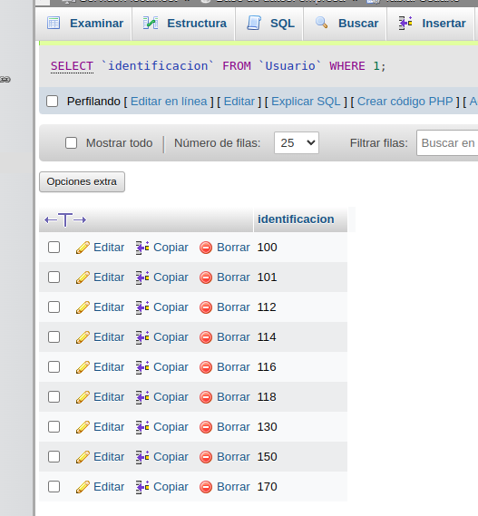

# consultas1.SQL

# EJERCICIOS CONSULTAS SQL

## Tabla de usuario

1. Para visualizar toda la informacion que contiene la tabla `usuario` se puede incluir con la instruccion SELECT el caracter'*' o cada uno de los campos 

SELECT * FROM `Usuario` 

2. Visualizar solamente la identificacion del usuario 

SELECT `identificacion` FROM `Usuario` 

3. Se desea obtener los registros cuya identificacion sean mayorres o iguales a 150, se debe utilizar la clausula WHere que especifica las condiciones que debe reunir los registros que se van a seleccionar 

SELECT * FROM `Usuario` WHERE identificacion>=`150`

4. Si se desea obtener los registros cuyo sus apellidos sean Vanegas o Cetina, se debe utilizar el operador IN que especifica los registros que se quieren visualizar de una tabla

SELECT `apellidos` FROM `Usuario` WHERE apellidos IN ('Vanegas','Cetina')

O se puede utilizar el operador OR 

SELECT `apellidos` FROM `Usuario` WHERE apellidos='Vanegas' OR apellidos='Cetina'

5. Si se desea obtener los registros cuya identificacion sea menor de '110' y la ciudad sea 'Cali', se debe utilizar el operador AND

SELECT * FROM `Usuario` WHERE identificacion<'110' AND ciudad_nac='Cali'

